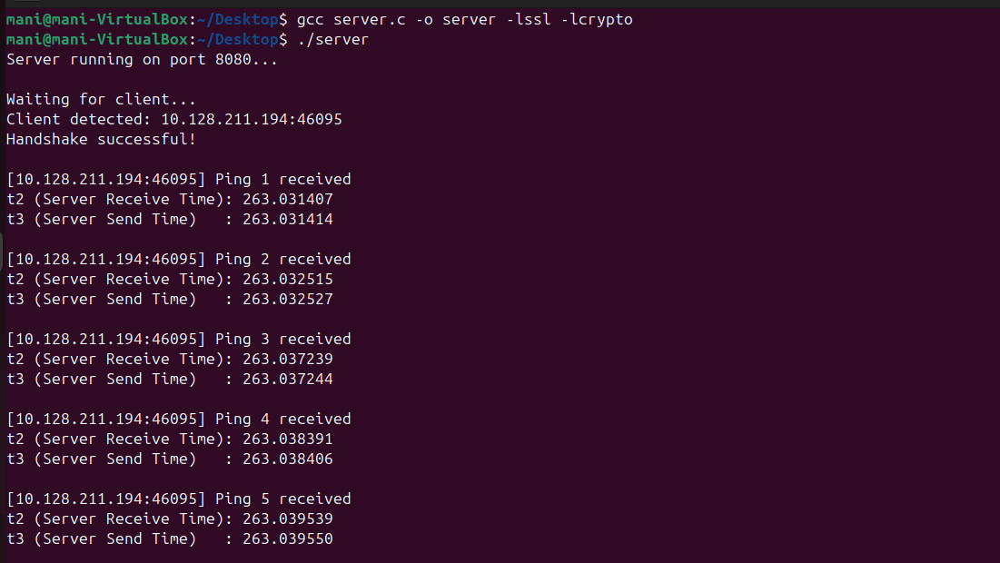
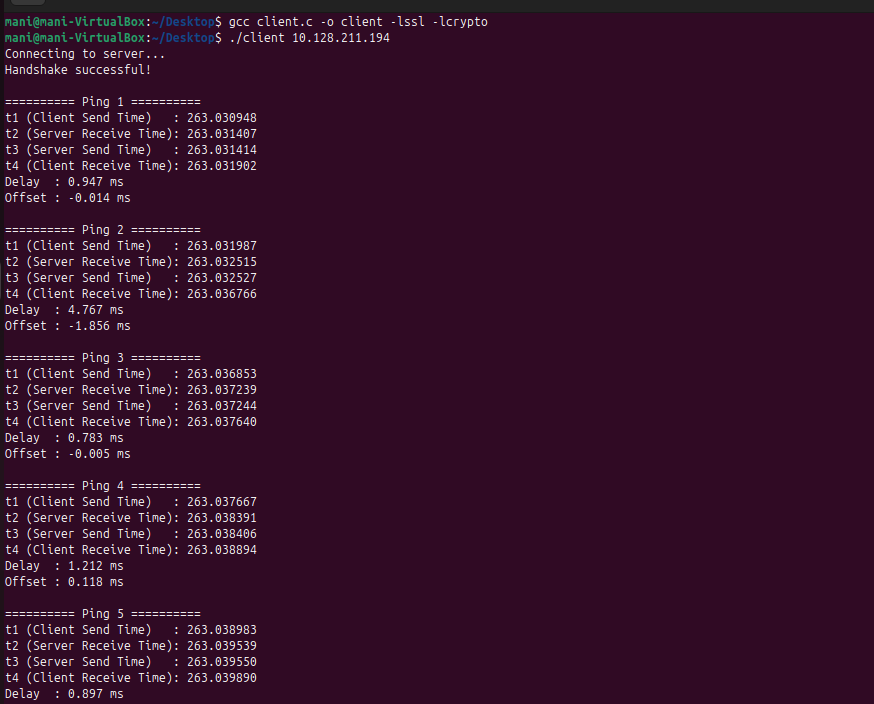

#  Distributed Clock Synchronization System (UDP)

## Team Members

* **N K Mani Sai Akhil**
  SRN: PES1UG24CS290

* **Narina Jeevan Naga Deep**
  SRN: PES1UG24CS293

* **Nandhakishore**
  SRN: PES1UG24CS291

---

## Overview

This project implements a **Distributed Clock Synchronization System** using **UDP sockets in C** with **OpenSSL-based secure communication**.
It follows a **time request-reply protocol** similar to NTP.

---

## Objectives

* Time synchronization using UDP
* Offset and delay calculation
* Drift correction
* Accuracy evaluation

---

##  Technologies Used

* C Programming
* UDP Socket Programming
* OpenSSL
* Linux (Ubuntu / VirtualBox)

---

##  System Architecture

* **Server**: Provides timestamps (T2, T3) securely
* **Client**: Sends requests and computes synchronization

---

##  Working Principle

### Time Request–Reply Protocol

* T1 → Client send
* T2 → Server receive
* T3 → Server send
* T4 → Client receive

---

### Calculations

**Offset (θ):**
θ = ((T2 - T1) + (T3 - T4)) / 2

**Delay (δ):**
δ = (T4 - T1) - (T3 - T2)

---

###  Drift Correction

Corrected Time = T4 + Offset

---

###  Accuracy Evaluation

Multiple requests are averaged to improve synchronization accuracy.

---

##  How to Run

### Compile

```bash
gcc server.c -o server -lssl -lcrypto
gcc client.c -o client -lssl -lcrypto
```

### Run Server

```bash
./server
```

### Run Client

```bash
./client <server_ip>
```

---

##  Running on Different Systems

* Use same WiFi network
* Replace IP in client
  Example:

```bash
./client 172.30.93.192
```

---

##  SSL Certificate Setup

This project uses OpenSSL for secure communication.

### Generate certificates:

```bash
openssl req -x509 -newkey rsa:2048 -keyout certs/server.key -out certs/server.crt -days 365 -nodes
```

### Important:

* `server.crt` is included in this repository
* `server.key` is NOT included for security reasons

Each user must generate their own private key locally.

---

##  Output Screenshots

### Server Output



### Client Output



---

##  Project Structure

```
.
├── server.c
├── client.c
├── README.md
├── certs/
│   └── server.crt
├── screenshots/
│   ├── server_output.png
│   └── client_output.png
```

---

##  Features

* Multi-client UDP support
* Secure communication using OpenSSL
* Offset and delay computation
* Drift correction
* Accuracy evaluation

---

##  Conclusion

This project demonstrates secure distributed clock synchronization using UDP and highlights the importance of delay and offset in achieving accurate time synchronization.

---
